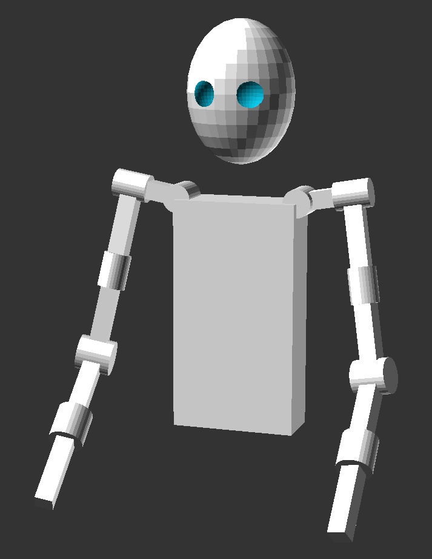

# Experiments

## `arm_visualizer.jl`

`arm_visualizer.jl` is a Julia program for generating OpenSCAD files which visualize the arm in given configurations. This program is intended for debugging purposes when experimenting with the vision system and inverse kinematics.

The required files for running this program are found [here](https://github.com/ase22003/CAD) and [here](https://github.com/ase22003/Julia-utils).
Run the following commands in the shell before attempting to execute a function in `arm_visualizer.jl`:
```
# From https://github.com/ase22003/Julia-utils
include("debug.jl")
include("utils.jl")
include("meta.jl")

# From https://github.com/ase22003/CAD
include("basic.jl")
include("shapes.jl")
include("linalg.jl")

# From this directory
include("arm_visualizer.jl")
```

The output file will be named `out.scad` and can be opened by OpenSCAD.



*Have fun!*
